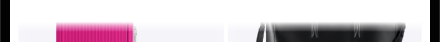
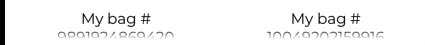

# react-native-blur-line

A lightweight, customizable gradient blur line for React Native. Perfect for creating soft fade-out effects at the top or bottom of `ScrollView`, `FlatList`, or `SectionList` components.

---

## Screenshots

<p align="center">
  
</p>

<p align="center">
  
</p>

<p align="center">
  
</p>

## Installation

This package requires `react-native-linear-gradient` as a peer dependency.

### 1. Install Peer Dependency

You **must** follow the **[Official Installation Guide](https://www.npmjs.com/package/react-native-linear-gradient)** for `react-native-linear-gradient` first.  
Since it contains native code, ensure you run `pod install` for iOS after installing it.

### 2. Install this library

```bash
# Using yarn
yarn add react-native-blur-line

# Using npm
npm install react-native-blur-line
```

## Usage

```tsx

import BlurLine from 'react-native-blur-line';

...


<BlurLine />

<FlatList
  ...
/>

<BlurLine bottom />
```

```tsx
<BlurLine color={#FF8800} />

<ScrollView>
  ...
</ScrollView>

<BlurLine bottom color="rgba(0, 0, 0, 1)" />
```

## Props

| Prop      | Type      | Default Value                                                                               | Description                                                                                  |
| --------- | --------- | ------------------------------------------------------------------------------------------- | -------------------------------------------------------------------------------------------- |
| bottom    | boolean   | false                                                                                       | If true, the gradient direction is inverted (fades out upwards) for the bottom of the screen |
| horizontal | boolean | false                                                                                        | If true, the blur line will be drawn for a horizontal list/view |
| color | string    | "rgba(255,255,255,1)"                                                                       | The starting color of the blur. Should be the same as your background color.                 |
| style     | ViewStyle | { width: '100%', height: 10, zIndex: 1 } with top: 10 or if bottom prop is true, bottom: 10 | Basically to override existing style and customize its usage as you like.                    |


## Color Format Support

```tsx
<BlurLine color="#000" />
<BlurLine color="#FF8800" />
<BlurLine color="#FF880080" />
<BlurLine color="rgb(255, 0, 0)" />
<BlurLine color="rgba(0, 0, 0, 1)" />
```
